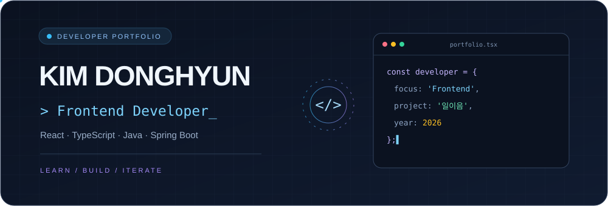

<div align="center">



**코드로 배우고, 프로젝트로 성장하는 개발자**

`@kimdonghyun12345` · Developer Portfolio


[Projects](#-projects) · [Tech Stack](#-tech-stack) · [Competitions](#-competitions)

</div>

---

## $ whoami

2026년 공모전에 「일이음」 프로젝트로 참여해 프론트엔드를 주로 담당했습니다. React와 TypeScript 기반 프론트엔드와 Java·Spring Boot 기반 백엔드 기술을 중심으로 학습과 개발 경험을 쌓고 있습니다.

```yaml
profile:
  github: kimdonghyun12345
  focus: [Frontend, React, TypeScript, Java, Spring Boot]
  interests: [Backend, Text Processing, OCR]
  learning: "Build → Understand → Improve"
```

## 🛠 Tech Stack

> 공개 저장소와 일이음 참가 신청서에 기재된 기술 구성입니다. 일이음은 구현 및 검증을 진행 중인 프로젝트입니다.

| 분야 | 참여·활용 기술 | 관련 저장소 |
| :--- | :--- | :--- |
| Frontend | React 18 · TypeScript · Vite · Tailwind CSS · Fetch API | 일이음 (프론트엔드 담당) |
| Language | Java · Java 17 | MyJava, CodingTest, SpringBootMyBaits, SpringAiBasic |
| Backend | Spring Boot · Spring Web · MyBatis · Lombok | SpringBootMyBaits |
| Database | MariaDB JDBC · Oracle JDBC | SpringBootMyBaits, SpringAiBasic |
| Web View | JSP · JSTL · Apache Tomcat · CSS | SpringBootMyBaits |
| Text & OCR | KOMORAN · Tess4J | SpringAiBasic, SpringBootMyBaits |
| Build & Collaboration | Maven · GitHub | SpringBootMyBaits, SpringAiBasic |

## 🚀 Projects

### 01 / 일이음
**장애인을 위한 AI 맞춤 직무 추천 서비스**

`2026 공모전 참여` `프론트엔드 중심 담당` `구현·검증 진행 중`

장애인 구직자의 희망 직무, 근무지역, 고용형태, 경력, 급여, 학력과 접근성 조건을 채용공고와 비교하여 개인에게 맞는 일자리를 추천하는 팀 프로젝트입니다. 종합 적합도뿐 아니라 항목별 점수, 추천 이유와 미충족 조건을 제공하는 서비스를 목표로 개발하고 있습니다.

**담당 역할** · 프론트엔드를 주로 담당

**프론트엔드 기술** · `React 18` `TypeScript` `Vite` `Tailwind CSS` `Fetch API`

**주요 화면 구성** · 회원가입, 구직자 프로필, 채용공고, 맞춤 추천 결과 및 백엔드 API 연동

<details>
<summary>팀 프로젝트 기술 구성 보기</summary>

| 영역 | 기술 구성 |
| :--- | :--- |
| Backend & Data | Java 17 · Spring Boot 4.x · MyBatis · MariaDB · REST API |
| AI | OpenAI 호환 Chat Completions API · Java 규칙 기반 평가 및 fallback |
| Public Data | 한국장애인고용공단(KEAD) 채용정보 OpenAPI · Java HttpClient · XML 파싱 |
| Location | Kakao Local API · Kakao Mobility Directions API |
| Build & Collaboration | Maven · Vite · GitHub |
| Cloud | Naver Cloud · NKS · Source Pipeline (신청서에 기재된 운영·배포 구성) |

</details>

### 02 / SpringBootMyBaits
**Java 웹 백엔드 & 데이터베이스 연동 학습 프로젝트**

Spring Boot 기반 웹 애플리케이션의 기술 구성을 담은 저장소입니다. MyBatis와 MariaDB JDBC, JSP/JSTL, 메일 및 OCR 관련 의존성이 포함되어 있습니다.

`Java 17` `Spring Boot` `Spring Web` `MyBatis` `MariaDB` `JSP` `Tess4J`

[소스 코드 보기 →](https://github.com/kimdonghyun12345/SpringBootMyBaits)

### 03 / SpringAiBasic
**텍스트 처리 & OCR 관련 기술 학습 프로젝트**

Spring Boot 환경에 한국어 형태소 분석 도구 KOMORAN과 OCR 라이브러리 Tess4J를 구성한 저장소입니다. MyBatis 및 Oracle JDBC 의존성도 포함되어 있습니다.

`Java 17` `Spring Boot` `KOMORAN` `Tess4J` `MyBatis` `Oracle JDBC`

[소스 코드 보기 →](https://github.com/kimdonghyun12345/SpringAiBasic)

### 04 / MyJava
**Java 학습 기록**

Java 코드를 모아 둔 학습 저장소입니다.

`Java`

[소스 코드 보기 →](https://github.com/kimdonghyun12345/MyJava)

### 05 / CodingTest
**코딩 테스트 학습 기록**

Java 기반 코딩 테스트 학습 코드를 관리하는 저장소입니다.

`Java`

[소스 코드 보기 →](https://github.com/kimdonghyun12345/CodingTest)

## 🏆 Competitions

### 공모전 참여 이력

| 참여 연도 | 공모전명 | 프로젝트 | 담당 역할 | 프론트엔드 기술 | 결과·수상 |
| :---: | :--- | :--- | :--- | :--- | :--- |
| 2026 | 일이음 | 일이음 — 장애인을 위한 AI 맞춤 직무 추천 서비스 | 프론트엔드 중심 담당 | React 18 · TypeScript · Vite · Tailwind CSS · Fetch API | 결과 발표 대기 |


---

<div align="center">

**LEARN · BUILD · ITERATE**

[GitHub @kimdonghyun12345](https://github.com/kimdonghyun12345)

</div>
